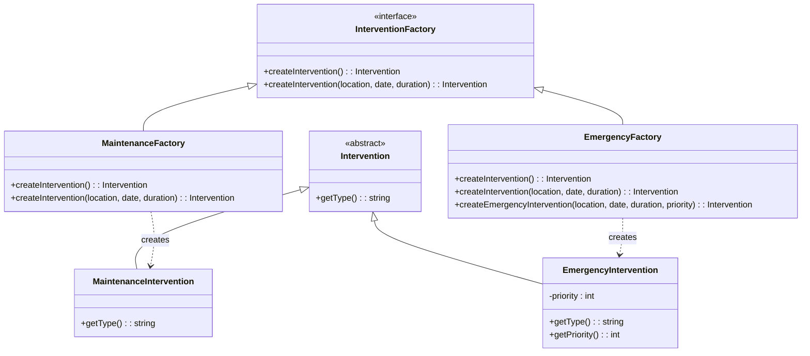
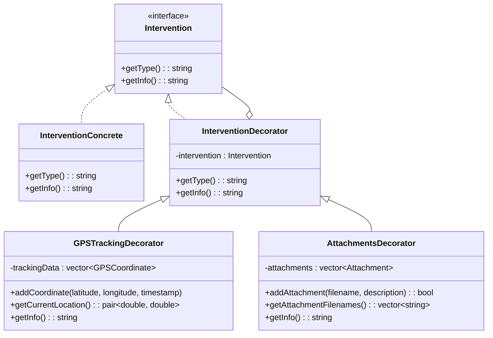
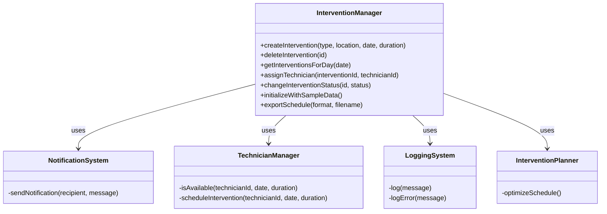
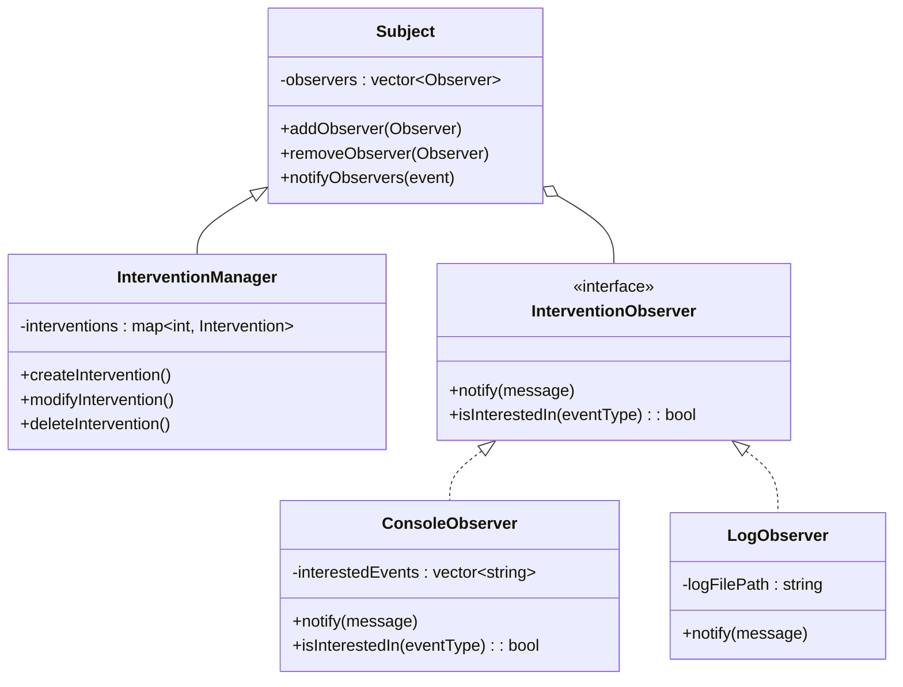
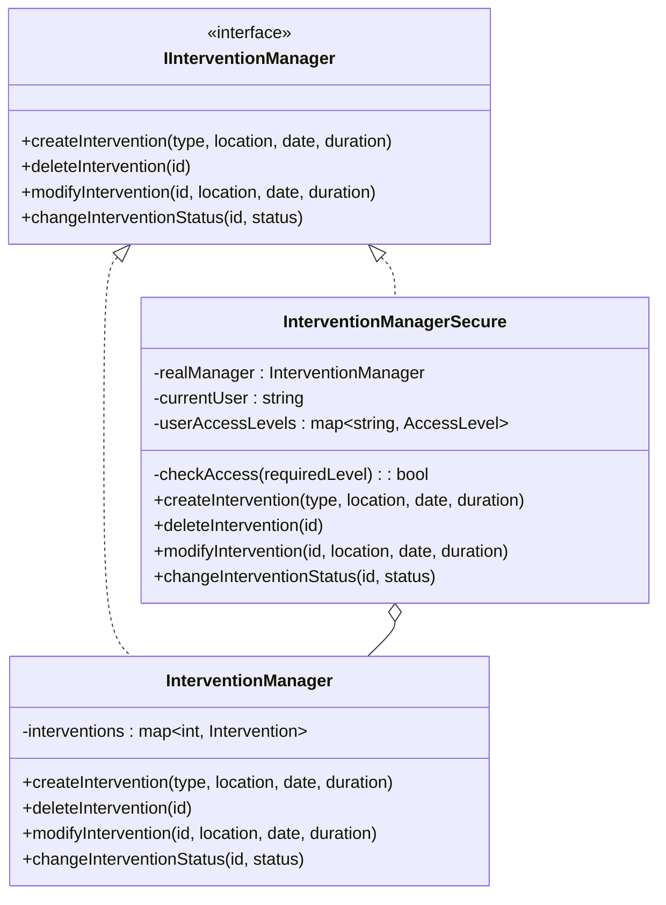
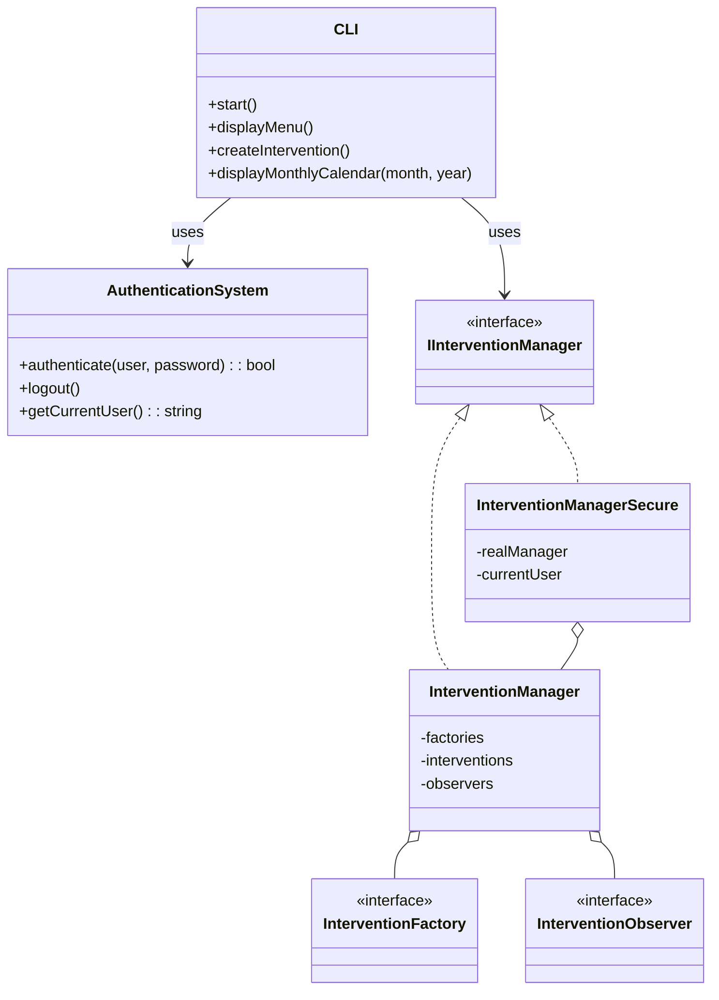

# TechInterventionPlanner
Scholar project for design pattern course

## Description
This console application allows you to manage the planning of technical interventions for a maintenance team. It implements several design patterns to offer an extensible, maintainable, and robust architecture. Developed in C++, it enables managers, technicians, and administrators to efficiently manage the schedule of technical interventions at different sites.

## Features
- Creation and management of technicians and interventions
- Automatic generation of intervention types (maintenance, emergency)
- Display of interventions by day or month
- Modification and closure of interventions
- Authentication system and access rights management
- Action logging
- Export to various formats (text, CSV, JSON)

## Data Persistence
**Important**: This application maintains data only for the current session. All data is stored in memory and will be lost when the application is closed. To preserve data, use the `export` command to create an external file before exiting.

## Implemented Design Patterns

### 1. Factory Method

**Definition:** This pattern provides an interface for creating objects of a parent class, while allowing subclasses to modify the type of objects created.

**UML Structure:**



**Implementation in our project:**
- Each intervention type (maintenance, emergency) has its own factory
- Factories are registered in the intervention manager
- When creating an intervention, the system dynamically selects the appropriate factory
- Client code only manipulates the Intervention interface without concerning itself with specific types

**Advantages:**
- The creation of specialized interventions is isolated from the rest of the code
- Adding new types of interventions does not require modifying existing classes
- The specifics of each intervention type are encapsulated in their respective classes


### 2. Decorator

**Definition:** This pattern allows for dynamically adding behaviors or responsibilities to an object without modifying its structure, by "wrapping" the object in other objects.

**UML Structure:**



**Implementation in our project:**
- The base object (Intervention) can be dynamically enhanced with:
  - GPS tracking to locate the technician
  - Attachments for technical documents
  - Notifications for automatic reminders
- Decorators can be freely combined according to needs
- Each decorator enriches the intervention's methods while preserving its interface

**Advantages:**
- Flexibility to add or remove features at runtime
- Avoids creating a multitude of subclasses for all possible combinations
- Respects the single responsibility principle (each decorator manages one concern)

### 3. Facade

**Definition:** This pattern provides a unified interface to a set of interfaces in a subsystem, defining a higher-level interface that makes the subsystem easier to use.

**UML Structure:**



**Implementation in our project:**
- The `InterventionManager` facade centralizes all complex operations
- It coordinates several subsystems:
  - Creation and management of interventions via factories
  - Notification of changes
  - Logging of actions
  - Checking technician availability
  - Optimal scheduling of interventions
  - Data export functionality
- The CLI interface interacts only with this facade

**Advantages:**
- Simplification of system use for client code
- Decoupling between subsystems and the user interface
- Centralization of coordination logic

### 4. Observer

**Definition:** This pattern defines a one-to-many dependency between objects, so that when one object changes state, all its dependents are notified and updated automatically.

**UML Structure:**



**Implementation in our project:**
- The `InterventionManager` (subject) maintains a list of observers
- For each significant event (creation, modification, deletion), observers are notified
- Different types of observers react differently:
  - `ConsoleObserver` : displays messages in the console
  - `LogObserver` : records events in a log file
  - Additional observers can be added for email or mobile notifications
- Observers can filter the events they are interested in

**Advantages:**
- Automatic communication between components without tight coupling
- Extensibility: new observers can be added without modifying the subject
- Distribution of responsibilities: each observer focuses on a type of notification

### 5. Proxy

**Definition:** This pattern provides a substitute or placeholder to control access to an object, adding a layer of indirection for additional functionality.

**UML Structure:**



**Implementation in our project:**
- The `InterventionManagerSecure` proxy encapsulates the real manager
- It implements the same `IInterventionManager` interface
- Before delegating each call to the real manager, it checks:
  - If the user is authenticated
  - If the user has appropriate rights (read/write)
  - If the action is authorized for their profile (admin, technician, manager)
- In case of rights violation, an exception is thrown or an error is returned

**Advantages:**
- Separation of concerns: security logic is isolated
- Transparent access control for client code
- Consistent application of security rules at all access points


## Global Architecture



## CLI Interface

The command-line interface offers several functionalities:
- User authentication
- Display of today's interventions
- Display of the monthly calendar
- Creation/modification/deletion of interventions
- Closure of interventions with comments
- Data export operations

## Available Commands

| Command | Description |
|---------|-------------|
| help | Display available commands |
| exit | Exit the application |
| login | Login with username and password |
| logout | Logout from the current session |
| list | List interventions for a specific date |
| view | View intervention details |
| create | Create a new intervention |
| modify | Modify an existing intervention |
| delete | Delete an intervention |
| assign | Assign a technician to an intervention |
| status | Change intervention status |
| addtech | Add a new technician |
| techs | List all technicians |
| calendar | Show calendar for a month |
| initialize | Initialize the system with sample data |
| export | Export schedule to a file (text, CSV, JSON) |
| decorate | Add a decorator to an intervention |
| addattachment | Add an attachment to a decorated intervention |
| addgpscoord | Add GPS coordinates to a decorated intervention |

## Execution Example

```
=== INTERVENTION MANAGER ===
1. Display today's interventions
2. Display interventions by date
3. Display monthly calendar
4. Create an intervention
5. Modify an intervention
6. Delete an intervention
7. Change intervention status
0. Exit
Your choice: 1

| ID | Type       | Location   | Time   | Duration | Technician | Status    |
|----+------------+------------+--------+----------+------------+-----------|
| 1  | Maintenance| Site A     | 14:30  | 120      | TECH001    | Scheduled |
| 2  | Emergency  | Site B     | 16:45  | 60       | TECH002    | In progress|
```

## How to Use the Application

1. **Compilation**
```bash
# Using CMake
mkdir build && cd build
cmake ..
make

# Direct compilation (alternative)
g++ -std=c++17 main.cpp -o intervention_manager
```

2. **Execution**
```bash
./intervention_manager
```

3. **Authentication**
   Preconfigured users:
- admin / admin123 (full rights)
- manager / manager123 (modify rights)
- tech / tech123 (limited rights)
- guest / guest123 (read-only rights)

4. **Data Initialization**
   After logging in as admin, use the `initialize` command to populate the system with sample data.

5. **Data Export**
   Before closing the application, use the `export` command to save the current state to a file:
```
export json interventions.json
```

## For Developers

### Adding New Intervention Types
1. Create a new class inheriting from `Intervention`
2. Create a factory class inheriting from `InterventionFactory`
3. Register the factory in `main.cpp` with the registry

### Adding New Decorators
1. Create a new decorator class inheriting from `InterventionDecorator`
2. Implement the required methods, especially `getInfo()`
3. Add necessary methods in `InterventionManager` to apply the decorator

### Extending the CLI
1. Add new command handlers in `CLI::initializeCommands()`
2. Implement handler methods following the established pattern

## To Develop and Improve

Here are some extension ideas:
- Adding a graphical interface (Qt/GTK)
- Implementing database persistence
- Adding CSV/PDF export of schedules
- Implementing a reminder and notification system
- Adding REST API integration with other systems

---

_This project was created as part of a course on design patterns._