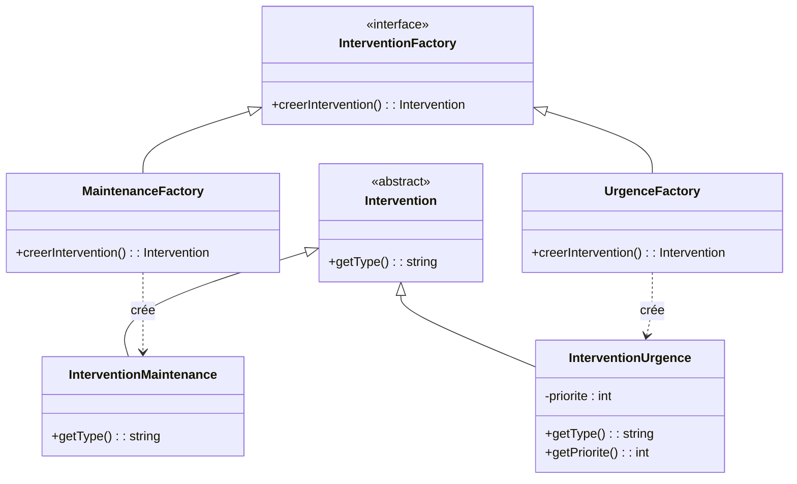
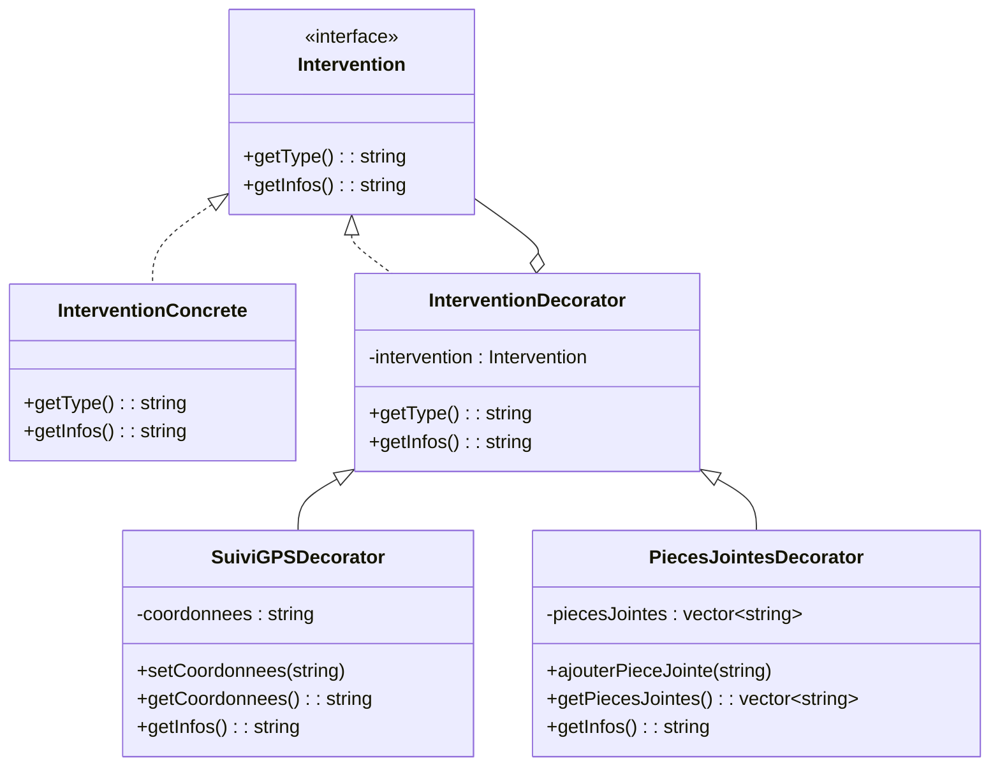
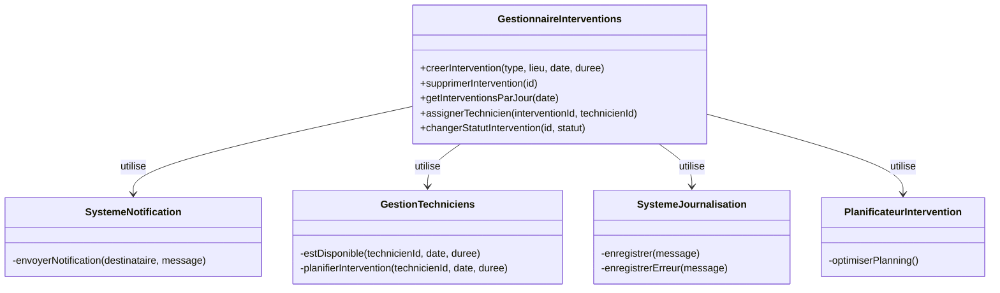
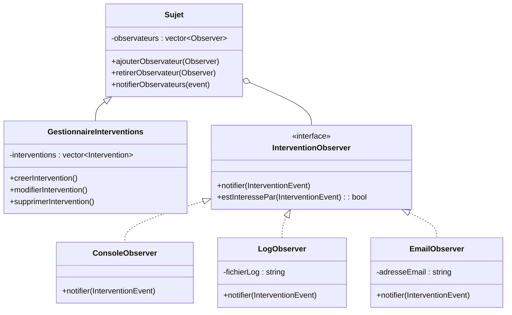
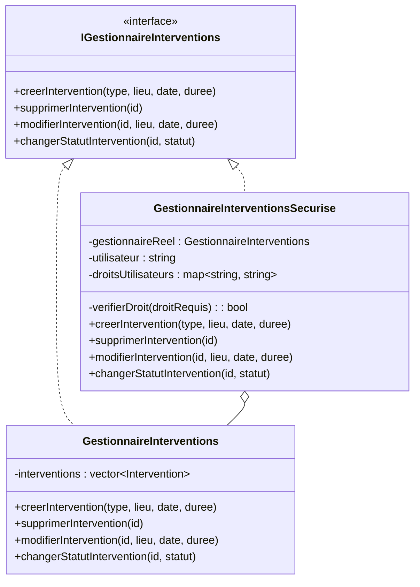
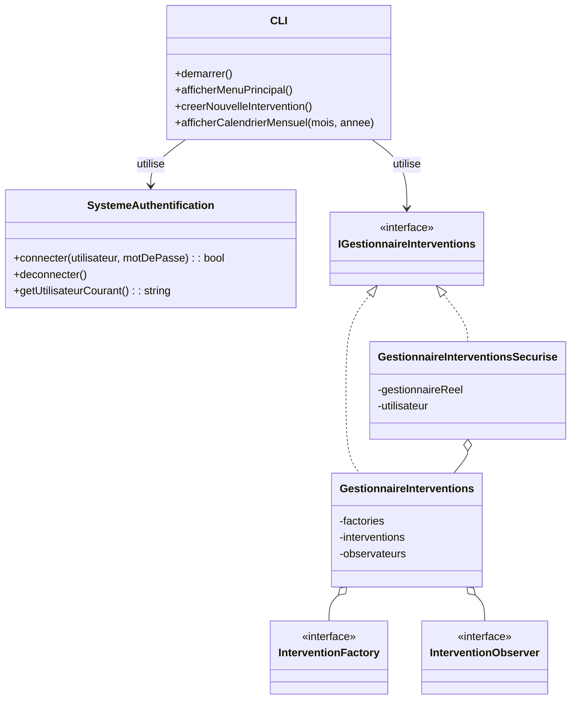

# TechInterventionPlanner
Scholar project for design pattern course

## Description
Cette application console permet de gérer la planification d'interventions techniques pour une équipe de maintenance. Elle implémente plusieurs design patterns pour offrir une architecture extensible, maintenable et robuste. Développée en C++, elle permet aux gestionnaires, techniciens et administrateurs de gérer efficacement le planning des interventions techniques sur différents sites.

## Fonctionnalités
- Création et gestion de techniciens et d'interventions
- Génération automatique d'interventions types (maintenance, urgence)
- Affichage des interventions par jour ou par mois
- Modification et clôture d'interventions
- Système d'authentification et gestion des droits
- Journalisation des actions

## Design Patterns implémentés

### 1. Factory Method

**Définition :** Ce pattern fournit une interface pour créer des objets d'une classe parente, tout en permettant aux sous-classes de modifier le type d'objets créés.

**Structure UML :**



**Implémentation dans notre projet :**
- Chaque type d'intervention (maintenance, urgence) possède sa propre Factory
- Les Factories sont enregistrées dans le gestionnaire d'interventions
- Lors de la création d'une intervention, le système sélectionne dynamiquement la Factory appropriée
- Le code client manipule uniquement l'interface Intervention sans se soucier des types spécifiques

**Avantages :**
- La création d'interventions spécialisées est isolée du reste du code
- L'ajout de nouveaux types d'interventions ne nécessite pas de modifier les classes existantes
- Les spécificités de chaque type d'intervention sont encapsulées dans leur classe respective

### 2. Decorator

**Définition :** Ce pattern permet d'ajouter dynamiquement des comportements ou responsabilités à un objet sans modifier sa structure, en "enveloppant" l'objet dans d'autres objets.

**Structure UML :**



**Implémentation dans notre projet :**
- L'objet de base (Intervention) peut être enrichi dynamiquement avec :
    - Suivi GPS pour localiser le technicien
    - Pièces jointes pour documents techniques
    - Notifications pour rappels automatiques
    - Options de facturation
- Les décorateurs peuvent être combinés librement selon les besoins
- Chaque décorateur enrichit les méthodes de l'intervention tout en préservant son interface

**Avantages :**
- Flexibilité pour ajouter ou retirer des fonctionnalités à l'exécution
- Évite la création d'une multitude de sous-classes pour toutes les combinaisons possibles
- Respect du principe de responsabilité unique (chaque décorateur gère une préoccupation)

### 3. Facade

**Définition :** Ce pattern fournit une interface unifiée à un ensemble d'interfaces d'un sous-système, définissant une interface de plus haut niveau qui rend le sous-système plus facile à utiliser.

**Structure UML :**



**Implémentation dans notre projet :**
- La façade `GestionnaireInterventions` centralise toutes les opérations complexes
- Elle coordonne plusieurs sous-systèmes :
    - Création et gestion des interventions via les factories
    - Notification des changements
    - Journalisation des actions
    - Vérification de disponibilité des techniciens
    - Planification optimale des interventions
- L'interface CLI interagit uniquement avec cette façade

**Avantages :**
- Simplification de l'utilisation du système pour le code client
- Découplage entre les sous-systèmes et l'interface utilisateur
- Centralisation de la logique de coordination

### 4. Observer

**Définition :** Ce pattern définit une dépendance un-à-plusieurs entre objets, de sorte que lorsqu'un objet change d'état, tous ses dépendants sont notifiés et mis à jour automatiquement.

**Structure UML :**



**Implémentation dans notre projet :**
- Le `GestionnaireInterventions` (sujet) maintient une liste d'observateurs
- À chaque événement significatif (création, modification, suppression), les observateurs sont notifiés
- Différents types d'observateurs réagissent différemment :
    - `ConsoleObserver` : affiche des messages dans la console
    - `LogObserver` : enregistre les événements dans un fichier journal
    - `EmailObserver` : envoie des notifications par email
    - `TechnicienMobileObserver` : simule l'envoi de notifications mobiles
- Les observateurs peuvent filtrer les événements qui les intéressent

**Avantages :**
- Communication automatique entre composants sans couplage fort
- Extensibilité : de nouveaux observateurs peuvent être ajoutés sans modifier le sujet
- Répartition des responsabilités : chaque observateur se concentre sur un type de notification

### 5. Proxy

**Définition :** Ce pattern fournit un substitut ou un placeholder pour contrôler l'accès à un objet, ajoutant une couche d'indirection pour des fonctionnalités supplémentaires.

**Structure UML :**



**Implémentation dans notre projet :**
- Le proxy `GestionnaireInterventionsSecurise` encapsule le gestionnaire réel
- Il implémente la même interface `IGestionnaireInterventions`
- Avant de déléguer chaque appel au gestionnaire réel, il vérifie :
    - Si l'utilisateur est authentifié
    - Si l'utilisateur a les droits appropriés (lecture/écriture)
    - Si l'action est autorisée pour son profil (admin, technicien, gestionnaire)
- En cas de violation des droits, une exception est levée ou une erreur est retournée

**Avantages :**
- Séparation des préoccupations : la logique de sécurité est isolée
- Contrôle d'accès transparent pour le code client
- Application cohérente des règles de sécurité à tous les points d'accès

## Architecture Globale



## Interface CLI

L'interface en ligne de commande offre plusieurs fonctionnalités :
- Authentification utilisateur
- Affichage des interventions du jour
- Affichage du calendrier mensuel
- Création/modification/suppression d'interventions
- Clôture d'interventions avec commentaires

## Exemple d'exécution

```
=== GESTIONNAIRE D'INTERVENTIONS ===
1. Afficher les interventions d'aujourd'hui
2. Afficher les interventions par date
3. Afficher le calendrier mensuel
4. Créer une intervention
5. Modifier une intervention
6. Supprimer une intervention
7. Clôturer une intervention
0. Quitter
Votre choix : 1

| ID | Type       | Lieu       | Heure  | Durée | Technicien | Statut    |
|----+------------+------------+--------+-------+------------+-----------|
| 1  | Maintenance| Site A     | 14:30  | 120   | TECH001    | Planifiée |
| 2  | Urgence    | Site B     | 16:45  | 60    | TECH002    | En cours  |
```

## Comment utiliser l'application

1. **Compilation**
```bash
g++ -std=c++17 main.cpp -o gestionnaire_interventions
```

2. **Exécution**
```bash
./gestionnaire_interventions
```

3. **Authentification**
   Utilisateurs préconfigurés :
- admin / admin123 (droits complets)
- user / user123 (droits de lecture seulement)
- tech / tech123 (droits limités)

## Pour développer et améliorer ce projet

Voici quelques idées d'extensions :
- Ajout d'une interface graphique (Qt/GTK)
- Persistance en base de données
- Export CSV/PDF des plannings
- Système de rappels et notifications
- API REST pour intégration avec d'autres systèmes

---

_Ce projet a été réalisé dans le cadre d'un cours sur les design patterns en C++._